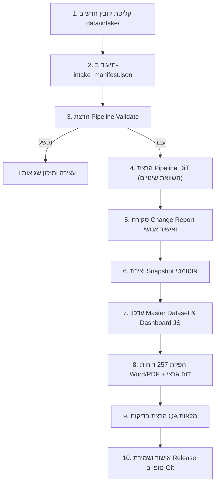

# מדריך הפעלה: צינור עדכון הנתונים והפקת הדוחות (Update Pipeline Guide)

מדריך זה מתאר את מנגנון העדכון האוטומטי והמבוקר של **מערכת פערי תקצוב חינוך ברשויות המקומיות**.  
המנגנון מאפשר קליטת נתוני מקור חדשים (כגון דוחות כספיים שנתיים חדשים של משרד הפנים או עדכוני למ״ס), השוואתם מול גרסת הבסיס, הרצת חישובי המודל, ביצוע בקרת איכות (QA) והפקה מחודשת של כל 257 הדוחות הרשותיים והארציים ב־Word וב־PDF.

---

## 1. מבנה התיקיות ושרשרת הנתונים

```text
09_מערכת_פערי_תקצוב_חינוך/
├── data/
│   ├── intake/                    # 📥 תיקיית קליטת קובצי מקור חדשים + intake_manifest.json
│   ├── raw/                       # 🗄️ ארכיון קובצי מקור היסטוריים (לעולם לא נמחקים)
│   ├── education_equity_master.json # 💎 Master Dataset הפעיל (Single Source of Truth)
│   └── education_equity_master.csv
├── snapshots/                     # 🛡️ גיבויי Snapshot מלאים לפני כל עדכון (לצורך Rollback)
├── reports/
│   └── diffs/                     # 📊 דוחות השוואה ושינויים (Change & Diff Reports)
├── pipeline/
│   ├── Update-Pipeline.ps1        # 🚀 סקריפט ה־CLI המרכזי להפעלת התהליך
│   ├── PipelineEngine.cs          # ⚙️ מנוע האימות, ה־Diff והשחזור (C#)
│   └── PipelineEngine.exe
├── generators/
│   ├── DocumentGenerator.cs       # 🖨️ מחולל 257 הדוחות הרשותיים (Word & Vector PDF)
│   └── DocumentGenerator.exe
├── output/                        # 📂 תוצרי המסמכים המופקים (Word, PDF, HTML)
└── FULL_257_REPORTS_QA.md         # ✅ דוח בקרת איכות סופי לכל 257 הרשויות
```

---

## 2. תהליך עדכון נתונים שלב־אחר־שלב (Workflow)



---

## 3. פקודות ההפעלה המרכזיות (`Update-Pipeline.ps1`)

ניתן להפעיל את הצינור באמצעות PowerShell:

### א. הרצת בדיקת יובש (Dry Run)
בודקת את שלמות כל השרשרת, יוצרת Snapshot, מוודאת את הנתונים ומפיקה את כל הדוחות מחדש:
```powershell
.\pipeline\Update-Pipeline.ps1 -Action DryRun
```

### ב. אימות קובץ נתונים מועמד (Validation Gate)
מוודאת קיום 257 רשויות ייחודיות, סמלי למ״ס תקינים, היעדר שדות חסרים/undefined ותקינות ערכים:
```powershell
.\pipeline\Update-Pipeline.ps1 -Action Validate -TargetFile "data\intake\new_dataset.json"
```

### ג. הפקת דוח השוואה ושינויים (Diff & Change Report)
משווה את הקובץ החדש מול ה־Master Dataset הקיים ומפיקה דוח ב־`reports/diffs/CHANGE_REPORT_<timestamp>.md`:
```powershell
.\pipeline\Update-Pipeline.ps1 -Action Diff -TargetFile "data\intake\new_dataset.json"
```

### ד. יצירת גיבוי Snapshot ידני
שומרת עותק מלא של הנתונים ודוחות ה־QA בתיקיית `snapshots/`:
```powershell
.\pipeline\Update-Pipeline.ps1 -Action Snapshot -Tag "BEFORE_2025_UPDATE"
```

### ה. בנייה מחדש והפקת דוחות (Rebuild)
מעדכנת את `app/data/master_data.js`, מקמפלת את מחולל המסמכים ומפיקה מחדש את כל 257 הדוחות:
```powershell
.\pipeline\Update-Pipeline.ps1 -Action Rebuild
```

### ו. שחזור לאחור (Rollback)
משחזרת באופן מלא את הנתונים והדוחות מתוך Snapshot קודם:
```powershell
# שחזור ל-Snapshot האחרון:
.\pipeline\Update-Pipeline.ps1 -Action Rollback

# שחזור ל-Snapshot ספציפי:
.\pipeline\Update-Pipeline.ps1 -Action Rollback -TargetFile "snapshot_20260920_223000_INITIAL_STATE"
```

---

## 4. שערי אימות ובקרות בטיחות (Validation Gates)

ה־Pipeline עוצר באופן אוטומטי במקרים הבאים:
1. **שינוי במבנה הנתונים (Schema):** עמודות חסרות או שמות שדות שאינם תואמים.
2. **אי־התאמה במספר הרשויות:** פחות או יותר מ־257 רשויות (מחייב בדיקה אנושית).
3. **כפילות בסמלי למ״ס:** זיהוי סמל למ״ס כפול או קוד לא תקין.
4. **שינוי אמפירי ב־P80:** אם נתוני ההכנסות העצמיות משנים את סף ה־P80, המערכת תציג התרעה מפורשת בדוח ה־Diff ותמתין להחלטת מדיניות האם לעדכן את הסף.
5. **ערכים לא הגיוניים:** אוכלוסייה שלילית, אשכול מחוץ לטווח 1–10, או ערכי `NaN`/`null`/`undefined`.

---

## 5. מדיניות הפרדה בין Data Update ל־Methodology Update

- **עדכון נתונים (Data Update):** מחליף את הנתונים הכספיים/דמוגרפיים של הרשויות (למשל מעבר משנת 2024 לשנת 2025).
- **עדכון מתודולוגי (Methodology Update):** שינוי משקולות (50/30/20), שינוי נוסחת ה־Taper, או שינוי מעריך הפרוגרסיביות. שינוי כזה מבוצע אך ורק בהוראה מפורשת ובגרסת מתודולוגיה חדשה (למשל `Methodology v2.0`).

---

## 6. מנגנון חסינות, Checkpoint ו־Resume (Recovery & Process Safety)

המערכת כוללת מנגנוני הגנה מתקדמים המבטיחים הרצה יציבה וחסינה מתקיעות:

1. **מנגנון Checkpoint / Resume חכם:**  
   מחולל הדוחות וה־PipelineEngine בודקים עבור כל רשות האם קובצי ה־Word (.docx), ה־HTML וה־PDF כבר הופקו באופן תקין ומלא (גודל מעל סף בטיחות). במקרה של הרצה חוזרת או התאוששות לאחר תקלה, המערכת מזהה את הקבצים הקיימים ומדלגת על הפקתם מחדש, מה שמאפשר השלמה מיידית (תוך שניות בודדות) במקום הפקה מלאה.
2. **הגבלת זמן בטוחה (Timeouts):**  
   - כל פעולת המרת PDF מוגבלת ל־15 שניות מקסימום. אם התהליך אינו מגיב, הוא מנוטרל אוטומטית.
   - הרצת ה־DocumentGenerator מוגבלת ל־15 דקות מקסימום.
3. **קריאת פלט אסינכרונית (Async Stream Output):**  
   קריאת הפלט של ה־Generator מתבצעת באופן אסינכרוני מבוסס אירועים (Event-driven), מה שמונע חסימות Stream במקרה של Child Processes ומשדר עדכוני התקדמות בזמן אמת (למשל `Rendered Vector PDFs: 50/257`).
4. **ניקוי תהליכים יתומים (Process Cleanup):**  
   בסיום כל ריצה ובבלוק `finally`, מתבצע ניקוי בטוח של תהליכי רקע יתומים ללא פגיעה בתוכנות פתוחות של המשתמש.

---

## 7. זכויות יוצרים, קרדיט והצהרת אחריות

כלל הדוחות המופקים דרך ה־Pipeline כוללים באופן אוטומטי ומובנה:
- **קרדיט:** `© 2026 גלעד גולדמן — כל הזכויות שמורות | דוא״ל: giladgo10@gmail.com`
- **הבהרה משפטית:** אזהרת מערכת ניסיונית הנמצאת בשלבי פיתוח ומחקר.
